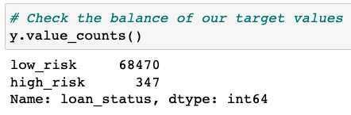
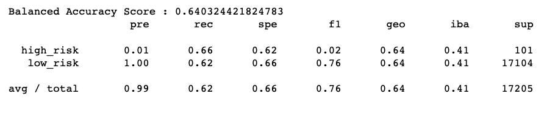
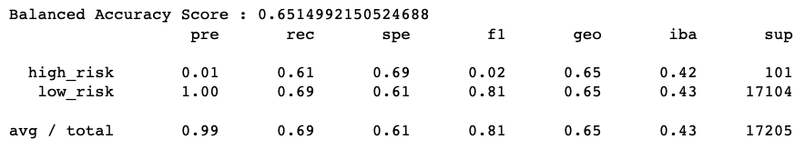
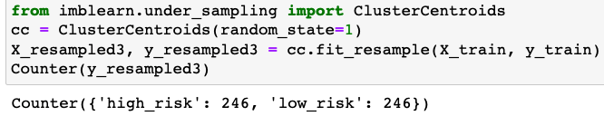
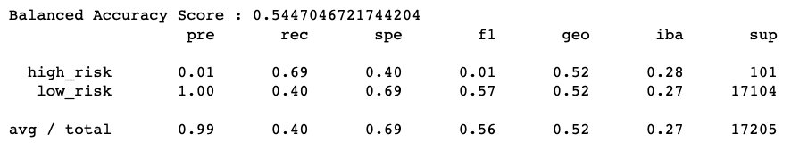
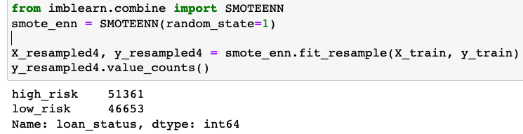
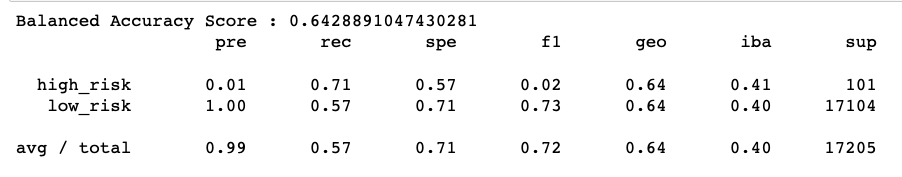
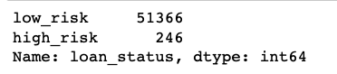
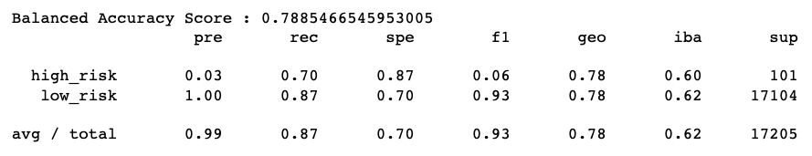
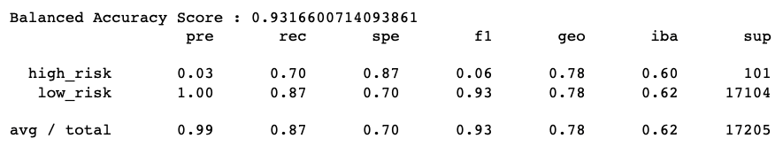

# Credit Risk Analysis
Using scikit-learn, imbalance-learn,  and Python pandas to process a dataset and perform Machine Learning analyses in order to predict credit risk. 

## Overview
The purpose of this project was to investigate loan data from a Lending Club dataset and apply different machine learning algorithms in an attempt to predict credit risk for individuals. Credit data is classically imbalanced to to good loans outnumbering risky or defaulted loans, so oversampling and undersampling techniques were used to explore the data. 

## Resources
  * Python
  * Pandas
  * scikit- learn
  * imbalance-learn
  * LendingClub dataset of 115,678 loan records

# Results
Before running the machine learning algorithms, the data first needed to be cleaned and processed. To do so, the data was read into a jupyter notebook and a series of cleaning techniques were applied.  Some of these included converting column data type to numerical using the get_dummies() method and combining loan status columns to reduce the classifications to just ‘high risk’ and ‘low risk’. Next, the target values (Loan Status) were split from the feature set in preparation for training and testing. Figure 1 displays the value counts for each of the two classes. 

Figure 1. Target Variable Class Value Counts

### Oversampling
To address the issue of imbalance of low risk loans to high risk loans, oversampling techniques were applied. First, Naive Random Oversampling was used to resample the data. Figure 2 shows the resampled value counts. Next, the Logistic Regression model was fitted with the training feature set and then tested with the testing set. Figure 3 displays the balanced accuracy, precision, recall and F1 scores. As can be seen, the Naive Random Oversampling model resulted in a low balanced accuracy score (0.64). The high risk class had a very low precision (0.01), low recall (0.66) and low F1 Score (0.02) where the low risk class had a very high precision (1.00), low recall (0.62) and moderately high F1 Score (0.76). This  suggests that the model is correctly  predicting high risk loans and low risk loans 64% of the time. For the high risk class, the low precision score indicates a potentially large number of false positive predictions for high risk while the high score for low risk loans indicate no false positive classification. The recall scores indicate the percentage chance that a positive prediction is indeed positive (high risk = %66, low risk = 62%. The F1 scores are reflective of the differences in precision and recall for the two classes as the high risk difference is more severe than that for the low risk class. 

Figure 2. Random Oversampling  

Figure 3. Random Oversampling Scores

Next, Synthetic Minority Oversampling Technique(SMOTE)  was investigated with the data. Then the Logistic Regression model was fitted with the resampled  training feature set and then tested with the testing set. Figure 4 displays the balanced accuracy, precision, recall and F1 scores. As can be seen, the SMOTE model resulted in a low balanced accuracy score (0.64). The high risk class had a very low precision (0.01), low recall (0.61) and low F1 Score (0.02) where the low risk class had a very high precision (1.00), moderate recall (0.69) and moderately high F1 Score (0.81). Little improvement was observed over the Random Oversampling technique. 

Figure 4. SMOTE Scores

### Undersampling
After investigating the oversampling algorithms, the analysis continued by testing undersampling techniques. First, Cluster Centroids was used to resample the data. Figure 5 shows the resampled value counts. Next, the Logistic Regression model was fitted with the resampled training feature set and then tested with the testing set. Figure 6 displays the balanced accuracy, precision, recall and F1 scores. As can be seen, the Cluster Centroid model resulted in a low balanced accuracy score (0.54). The high risk class had a very low precision (0.01), moderate recall (0.69) and low F1 Score (0.01) where the low risk class had a very high precision (1.00), low recall (0.40) and moderate F1 Score (0.57). It appears that the clustered centroid model had lower predictive power than models tested thus far. 

Figure 5. Cluster Centroid Undersampling Counts 

Figure 6. Cluster Centroid Undersampling  Scores

### Combination (Over and Under) Sampling
After investigating the undersampling algorithms, testing continued by combining over and under sampling techniques. To do so, Synthetic Minority Oversampling Technique and Edited Nearest Neighbors (SMOTEENN) was used to resample the data. Figure 7 shows the resampled value counts. Next, the Logistic Regression model was fitted with the resampled training feature set and then tested with the testing set. Figure 8 displays the balanced accuracy, precision, recall and F1 scores. As can be seen, the SMOTEENN model resulted in a low balanced accuracy score (0.64). The high risk class had a very low precision (0.01), moderately high recall (0.71) and low F1 Score (0.02) where the low risk class had a very high precision (1.00), moderate recall (0.57) and moderately high F1 Score (0.73). In this analysis it appears that the results were more similar to those of the oversampling models with only slight improvement to the recall for the high risk class. 

Figure 7. SMOTEENN Counts 

Figure 8. SMOTEEN  Scores

### Ensemble Classifiers
After testing undersampling, oversampling, and their combinations, two different ensemble classifiers were tested for predicting credit risk with the dataset. First, the Balanced Random Forest Classifier was used to resample the data. Figure 9 shows the resampled value counts. Next, the model was fitted with the training feature set and then tested with the testing set. Figure 10 displays the balanced accuracy, precision, recall and F1 scores. As can be seen, the Balanced Random Forest Classifier model resulted in a higher balanced accuracy score (0.79) than other models. Although somewhat improved, the high risk class had a very low precision (0.03), moderately high recall (0.71) and low F1 Score (0.06) where the low risk class had a very high precision (1.00), high recall (0.87) and a high F1 Score (0.93). Here there was clearly an improvement in balanced accuracy. Unfortunately precision was still low suggesting that the models are still predicting a lot of false positives for high risk. 

Figure 9. Balanced Random Forest Sample Counts  

Figure 10. Balanced Random Forest Scores

Next, the Easy Ensemble AdaBoost Classifier was used to resample the data. Then, the model was fitted with the training feature set and then tested with the testing set. Figure 11 displays the balanced accuracy, precision, recall and F1 scores. As can be seen, the Easy Ensemble AdaBoost Classifier model resulted in an even higher balanced accuracy score (0.93) than other models. Again, the high risk class had a very low precision (0.03), moderately high recall (0.70) and low F1 Score (0.06) while the low risk class again had a very high precision (1.00), high recall (0.87) and a high F1 Score (0.93). The Easy Ensemble Classifier model arguably had the highest predictive power as can be seen across the elevated scores. Again the very low precision score was observed suggesting that the model also may be predicting a lot of false positives for high risk. 

Figure 11. Easy Ensemble AdaBoost Classifier Scores

# Summary
In conclusion, a number of supervised machine learning sampling and modeling algorithms were trained and tested with credit data from LendingClub. For all of the models, prediction precision for the low risk class was very powerful as evidenced by high precision scores and generally moderate recall scores. However, the same could not be said for the high risk class.  In all models, the precision score was very low suggesting potential over prediction of false positives. Depending on the overall evaluation protocol a lender may use to evaluate the applicants, this may be acceptable. For example, deploying a machine learning algorithm could greatly speed up the efficiency of application classification to set up for next steps in the evaluation process.  Clearly some of these models are very accurately predicting low risk loan characteristics. For those classified as high risk, a next step could be to look more closely at the application details or interview the applicant to check for a false positive algorithmic evaluation. 

